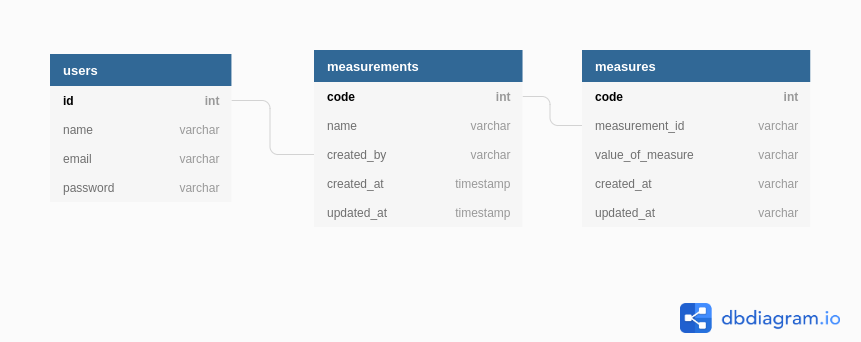

# TrackLife

This is the Final Capstone Project for the Microverse Program, with the following requirements:

- The project is a mobile web app
- The database has 2 tables (Measures and Measurements)
- It uses Postgres as a database
- Ruby on Rails was used for the back-end and to create a REST API
- React was used for the front-end and uses redux to store the info across the app
- The project is deployed accessible online
- Implemented 2 nice-to-have requirements: user authentication from the front-end to the server and a panel to create / update / delete things to measure;

## **Built With**

- Ruby on Rails
- JWT
- Heroku

## **How To Use**

### **Structure**

This app is the back-end of the following project: [TrackLife - Front-End](https://github.com/Davidosky007/tracking-app-react)

The following diagram represents the relationship of the tables:

### **Endpoints of API**

| Endpoint                                 |                          Functionality |
| ---------------------------------------- | -------------------------------------: |
| POST /signup                             |                           Create Users |
| POST /auth/login                         |                           Log In Users |
| GET /api/v1/measurements                 |                   Get all Measurements |
| GET /api/v1/measurements/:id             |              Get Specific Measurements |
| DELETE /api/v1/measurements              |                     Remove Measurement |
| GET /api/v1/measurements/:id/measures    | Get Measures of a Specific Measurement |
| POST /api/v1/measurements/:id/measures   |             Add Measure to Measurement |
| DELETE /api/v1/measurements/:id/measures |                     Remove Measurement |

## [LiveVersion](https://test-final-appli.herokuapp.com/)

## **Getting Started**

Clone the repository by clicking on "Clone or Download" and copy the given link. In your terminal, go to the folder where you want the project to be and use the following command:

`git clone https://github.com/Davidosky007/tracking-api-rails`

`rails db:create db:migrate db:seed`

## **Starting the Server**

**To start the server run:**  
`rails s -p 3001`

## **Testing**

**To check the test run the following command:**  
`bundle exec rspec`

👤 **David Bassey**

* GitHub: [@davidosky007](https://github.com/davidosky007)
* Twitter: [@davidosky2](https://twitter.com/Davidosky2)
* LinkedIn: [David Bassey](https://www.linkedin.com/in/david-bassey-akan/)

## 🤝 Contributing

Contributions, issues, and feature requests are welcome!

## Show your support

Give a ⭐️ if you like this project!

## Acknowledgments

- To Microverse for their `README` template.

## 📝 [License](https://creativecommons.org/licenses/by-nc-nd/4.0/)
